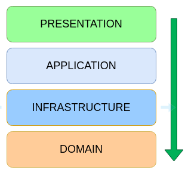

## ST - Scheduled Transfer

Scheduled Transfer is an API to schedule financial transfers.
### Reference Documentation

##### Technologies and libraries used to help develop the ST
* SDKMan
* Java 14.0.2 Java.Net Open
* Apache Maven
* Git
* Spring Boot 2.3.2
* Lombok
* Junit 5
* Mockito
* Arch Unit

##### Methodology
* TDD has been applied to begin the functionalities
* Arch Unit has being used to define the architecture since begin
  
Architecture model  

### Install
What do you need to do to run the ST

* Install Java 14.0.2
* Install Apache Maven
* Install Git
* Clone the project from github
    git clone https://github.com/arilsonsantos/scheduledtransfer.git  
    Go to the application directory, ex:

         cd scheduledtransfer

    And then, type:

        mvn spring-boot:run

### How to user the URIs  
The default language is English, but you can switch it to Portuguese trhough the header adding the Accept-Language.  
* 

      Accept-Language  PT
 
     
 
##### Add a user  
http://localhost:8080/api/public/users
  * Request:  
          
        POST
        
        {
           "username": "johnn",
           "password": "123"
        }
    
      
  * Response(s):  
  
        201 Created
        {
           "id": 1,
           "username": "johnn"
        }
                
        400 Bad requests
        {
           "statusCode": 400,
           "message": "Username already exists",
           "exception": "ResourceAlreadyExistsException",
           "timestamp": "9999-99-99T99:99:99.999999"
        }
        {
            "statusCode": 400,
            "message": "Invalid argument(s)",
            "exception": "MethodArgumentNotValidException",
            "timestamp": "9999-99-99T99:99:99.999999",
            "errors": {
                "username": "Username must have between 5 and 20 characters."
            }
        }
       
        
       
##### Create an account for a user  
http://localhost:8080/api/protected/accounts  
  * Request:  
Basic auth (username and password)  
POST  

        {
            "number":"000001"
        }

    Response(s):  
  
        201 Created
        {
            "id": 1,
            "number": "000001"
        }
        
        400 Bad requests
        {
            "statusCode": 400,
            "message": "Account number must have 6 numbers",
            "exception": "AccountNumberFormatException",
            "timestamp": "9999-99-99T99:99:99.999999"
        }
        {
            "statusCode": 400,
            "message": "Invalid argument(s)",
            "exception": "MethodArgumentNotValidException",
            "timestamp": "9999-99-99T99:99:99.999999",
            "errors": {
                "number": "Account number must have 6 characters/numbers"
            }
        }
        {
            "statusCode": 400,
            "message": "There is already an account with this number",
            "exception": "ResourceAlreadyExistsException",
            "timestamp": "9999-99-99T99:99:99.999999"
        }
   
    GET  
        
        200 OK
        (Pageable)  
        "content": [
                {
                    "id": 1,
                    "number": "000001"
                }
            ],...
            
        204 No Content

##### Do a transfer  
http://localhost:8080/api/protected/transfers
  * Request:  
  Basic auth (username and password)  
  POST          
        
        {
            "accountFrom":"000001",
            "accountTo":"000002",
            "amount":1000.00,
            "dateSchedule":"2020-08-14"
        }
    
      
  * Response(s):  
  
        201 Created
        {
            "id": 1,
            "accountFrom": "000001",
            "accountTo": "000002",
            "amount": 1000.00,
            "tax": 120.00,
            "dateRegistration": "2020-08-04",
            "dateSchedule": "2020-08-14",
            "taxType": "B"
        }
                
        400 Bad requests
        {
            "statusCode": 400,
            "message": "Account not found",
            "exception": "AccountNotFoundException",
            "timestamp": "9999-99-99T99:99:99.999999"
        }
        {
            "statusCode": 400,
            "message": "Account not exist or belongs to another user",
            "exception": "AccountNotFoundException",
            "timestamp": "9999-99-99T99:99:99.999999"
        }
        {
            "statusCode": 400,
            "message": "Invalid argument(s)",
            "exception": "MethodArgumentNotValidException",
            "timestamp": "9999-99-99T99:99:99.999999",
            "errors": {
                "accountFrom": "Account must not be null/empty."
                "accountTo": Account must not be null/empty.",
                "dateSchedule": "DateSchedule must not be null",
                "amount": "Ammount must not be null.",
            }
        } 
  
            
##### List transfers by account 
http://localhost:8080/api/protected/transfers/999999   
  * Request:  
  Basic auth (username and password)  
  GET  
 
   * Response(s): 
              
         200 OK
         (Pageable)  
         "content": [
                 {
                     "id": 1,
                     "accountFrom": "000001",
                     "accountTo": "000002",
                     "amount": 1000.00,
                     "tax": 120.00,
                     "dateRegistration": "2020-08-04",
                     "dateSchedule": "2020-08-14",
                     "taxType": "B"
                 }
             ],...
                
         204 No Content  
            
         400 Bad request
         {
             "statusCode": 400,
             "message": "Account not found",
             "exception": "AccountNotFoundException",
             "timestamp": "9999-99-99T99:99:99.999999",
         }   
         {
             "statusCode": 400,
             "message": "Account not exits or belongs to another user.",
             "exception": "AccountNotFoundException",
             "timestamp": "9999-99-99T99:99:99.999999",
         }     
